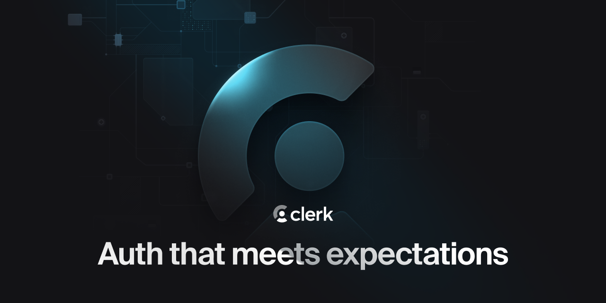

<p align="center">
  <a href="https://www.clerk.com/?utm_source=github&utm_medium=starter_repos&utm_campaign=organization_demo" target="_blank" rel="noopener noreferrer">
    <picture>
      <source media="(prefers-color-scheme: dark)" srcset="./public/light-logo.png">
      
    </picture>
  </a>
  <br />
</p>
<div align="center">
  <h1>
    Clerk Organizations Demo
  </h1>  
  <a href="https://www.npmjs.com/package/@clerk/clerk-js">
    
  </a>
  <a href="https://clerk.com/docs?utm_source=github&utm_medium=starter_repos&utm_campaign=organizations_starter">
    
  </a>
  <a href="https://discord.com/invite/b5rXHjAg7A">
    
  </a>
  <a href="https://twitter.com/clerkdev">
    
  </a> 
  <br />
  <br />
  
</div>

---

## Introduction

Clerk is a developer-first authentication and user management solution. It provides pre-built React components and hooks for sign-in, sign-up, user profile, and organization management. Clerk is designed to be easy to use and customize, and can be dropped into any React or Next.js application.

Clerk organizations are a way of grouping your application's users. Organizations are shared accounts, useful for project and team leaders — think of GitHub Teams, or the different departments of a company.

This starter project shows how to use [Clerk](https://www.clerk.com/?utm_source=github&utm_medium=starter_repos&utm_campaign=organizations_starter) with Next.js to build a rather lean interface, showcasing the power of the [organizations feature](https://clerk.com/docs/organizations/overview?utm_source=github&utm_medium=starter_repos&utm_campaign=organizations_starter).

## Live Demo

[https://organizations-demo.clerk.app](https://organizations-demo.clerk.app)

## Running the demo

### Prerequisites

- React v18

- Node.js v18+

### Setup

```bash
gh repo clone clerk/organizations-demo
```

To run the example locally, you need to:

1. Sign up at [Clerk.com](https://www.clerk.com/?utm_source=github&utm_medium=starter_repos&utm_campaign=organizations_starter). 

2. Go to your [Clerk dashboard](https://dashboard.clerk.com/?utm_source=github&utm_medium=starter_repos&utm_campaign=organizations_starter) and enable the Organizations feature. 

3. Set up your Publishable key and other variables, as shown in our [Getting started tutorial](https://clerk.com/docs/quickstarts/get-started-with-nextjs#install-clerk-s-sdk?utm_source=github&utm_medium=starter_repos&utm_campaign=organizations_starter). 

4. `npm install` to install the required dependencies. 

5. `npm run dev` to launch the development server. 

## Learn more

To learn more about Clerk and Next.js, and the organizations feature, check out the following resources:

- [Clerk's organizations feature](https://clerk.com/docs/organizations/overview?utm_source=github&utm_medium=starter_repos&utm_campaign=organizations_starter) 

- [Quickstart: Get started with Next.js and Clerk](https://clerk.com/docs/quickstarts/nextjs?utm_source=DevRel&utm_medium=docs&utm_campaign=templates&utm_content=10-24-2023&utm_term=clerk-nextjs-pages-quickstart)

- [Clerk Documentation](https://clerk.com/docs?utm_source=DevRel&utm_medium=docs&utm_campaign=templates&utm_content=10-24-2023&utm_term=clerk-nextjs-pages-quickstart)

- [Next.js Documentation](https://nextjs.org/docs)

## Found an issue?

If you have found an issue with the quickstart, please create an [issue](https://github.com/clerkinc/clerk-nextjs-pages-quickstart/issues).

If it's a quick fix, such as a misspelled word or a broken link, feel free to skip creating an issue.  
Go ahead and create a [pull request](https://github.com/clerkinc/clerk-nextjs-pages-quickstart/pulls) with the solution. :rocket:

## Want to leave feedback?

Feel free to create an [issue](https://github.com/clerkinc/clerk-nextjs-pages-quickstart/issues) with the **feedback** label. Our team will take a look at it and get back to you as soon as we can!

## Connect with us

You can discuss ideas, ask questions, and meet others from the community in our [Discord](https://discord.com/invite/b5rXHjAg7A).

If you prefer, you can also find support through our [Twitter](https://twitter.com/ClerkDev), or you can [email](mailto:support@clerk.dev) us!
